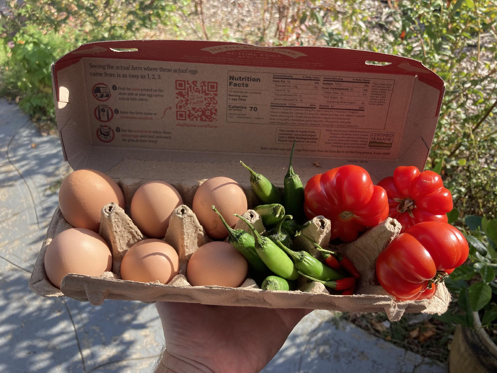
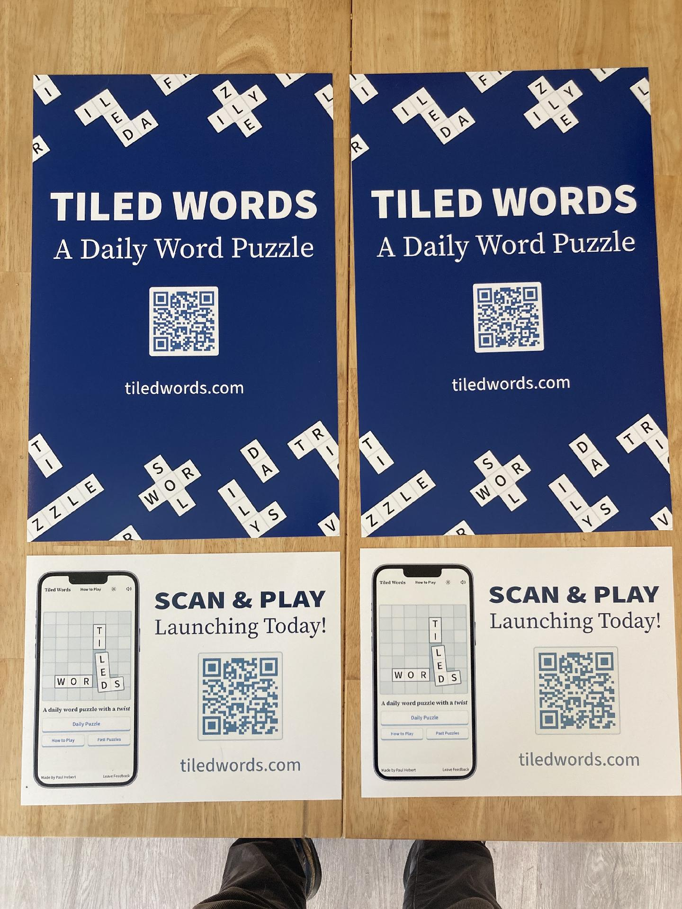
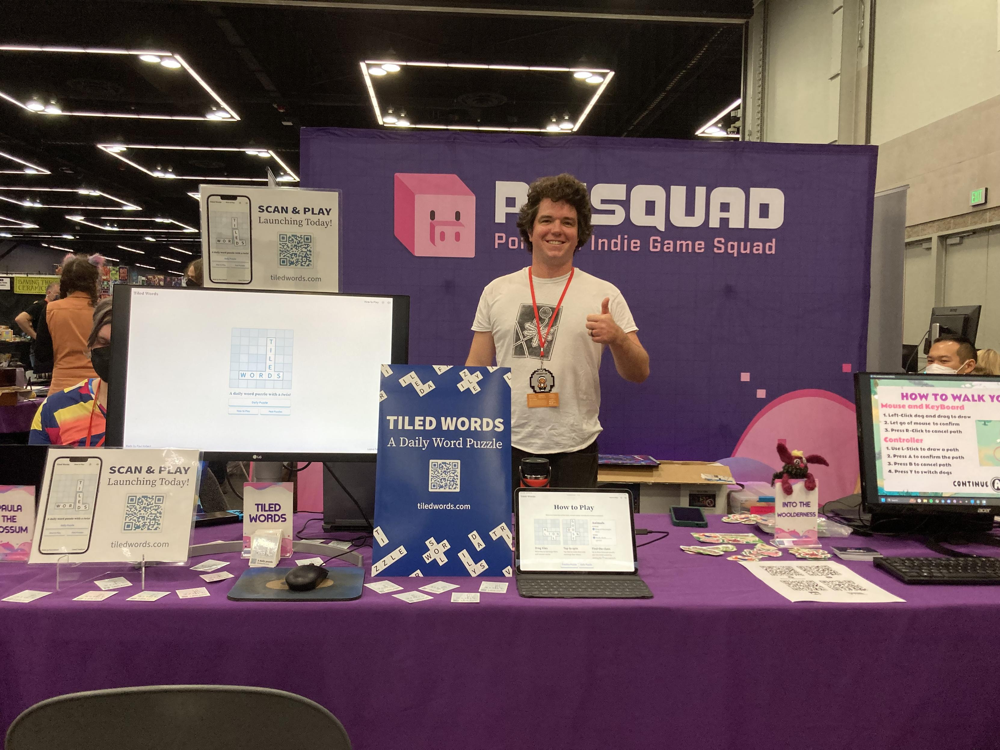

A little over a month ago, I was nervously getting ready to launch my daily puzzle game, [Tiled Words](https://tiledwords.com). (If you haven't played it yet, give it a try!)

Since then, over 36,000 people have spent nearly 6,000 hours solving puzzles and exploring the site. I wanted to share my experience so far, and talk about the next steps for Tiled Words.

## Getting ready to launch

The last few days before the launch were a blur. I fixed bugs, implemented new features, made my friends playtest, and frantically created new puzzles.

At the same time I was preparing to showcase at the Portland Retro Gaming Expo with [The Portland Indie Game Squad](https://pigsquad.com/). I traded fresh eggs and garden veggies with our neighbor in exchange for their poster printing service, ordered stickers, and figured out how I was going to showcase my game.

(Thanks [Tyler Sticka](https://tylersticka.com/) for letting me know about the expo!)

On top of all this, I was also caring for my 6 week old baby. (My wife is a saint!)

## The launch

Late on the night of October 18th, I put the baby to sleep and stayed up late working on finishing touches. I felt like a kid waiting up for Santa Claus. I got up early the next day and pushed the code changes that officially launched Tiled Words. I shared it on social media, sent an email to the waiting list, and drove down to the gaming expo.

Everyone with The Portland Indie Game Squad was friendly and had awesome games they were developing and sharing. (Shout out to my neighbor Ben and [his sheep-herding, dog-sweater-knitting, rhythm game!](https://store.steampowered.com/app/3434870/Into_the_Woolderness/)) It was lovely to watch people play the game, and I learned a lot about what was and wasn't working.

## Making a new puzzle every day

It's been a lot of fun (and a lot of work) making new puzzles. Each puzzle takes somewhere between 20 minutes to 2 hours to put together. My wife has been a huge help here and you have her to thank for the quality of the puzzle clues.

Before launch I had about a month's worth of puzzles ready. At that point she offered to help and we made a puzzle together, and it was _way, way better_ than the puzzles I was making alone. Her clues used homonyms, double meanings, and compound words in really interesting ways. I realized then that I needed to toss the old puzzles and start from scratch, so, about a week before launch I scrapped all 30 puzzles and started over.

The new style of puzzle takes longer to build but is a lot more fun to play and solve. My wife and I have a shared notes file where we add themes and clues. Once every day or two we'll sit down to review some puzzles and finalize the clues. Once that's done I use [custom tools I built](https://paulmakeswebsites.com/writing/building-tools-for-myself/) to turn them into Tiled Words puzzles. (This has come a long way from my early days of graph paper and hand-coded levels.)

## Learning from your feedback

One of the best decisions I made was to ask for feedback often and early. I shared demos and prototypes throughout the development cycle for early feedback. I added a waitlist feature to the demo, allowing people who tried it to sign up and be emailed on the launch. This got me a few hundred people excited to play on day 1.

I also added a custom feedback form within Tiled Words itself. When someone finishes a puzzle, I give them the opportunity to leave feedback and lots of people use it!

From bug reports, to feature ideas, to kind words, this feedback is super helpful. It's shaped how the game works today, and helps inform its next steps. I have a large backlog of excellent suggestions I plan to implement when I have time.

## Looking back at the last month

I’ve been blown away by everyone’s response to Tiled Words. It’s been really fun watching people play and share the game. Here are some stats from the first month of Tiled Words (October 19th&thinsp;&ndash;&thinsp;November 18th):

- 33 puzzles released
- Over 1,000 people complete the daily puzzle every day
- Over 36,000 unique visitors
- Nearly 6,000 hours of puzzles played
- Over 23,000 puzzles completed
- 300 people completed every single puzzle. (Over 800 finished more than half.)
- Over 3,500 puzzles shared
- Over 180 feedback submissions
- Over 50 community clue submissions

Thank you so much to everyone who has played, shared, or left feedback. It means a lot to me and makes all of the work on the game worth it.

## Next Steps

There's a lot that I'd like to do with Tiled Words. There are a few bug reports I'm still working through and lots of smaller feature ideas I'd like to implement. Right now my main focuses are:

- Building a more comprehensive backlog of puzzles
- Building custom puzzles users have submitted and sharing them with the community
- Exploring ways to make the puzzle grid feel less "cramped"
- Merging tiles when you get the right word in the wrong direction
- Launching a "puzzle builder" interface allowing users to create and share their own puzzles (moderation and user accounts need to be thought through)
- And lots more!

Beyond that, let me know what you'd like to see in Tiled Words and I'll try to make it happen! [And go play the daily puzzle!](https://tiledwords.com)
