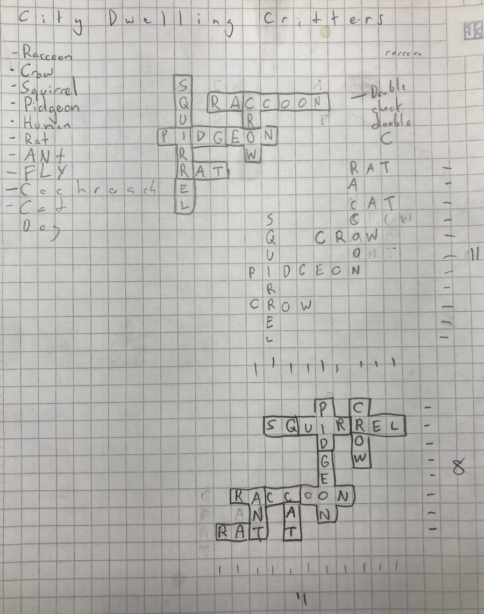

Building tools for yourself gives you a lot of freedom and can be really satisfying. Tonight I built some hacky tools to help me generate crossword puzzles.

## Tiled Words

I've been having a lot of fun lately building a little word game. Every day there will be a new puzzle to play where you take tiles with letters on them, and move them around to find words and rebuild a broken crossword. Here's a quick video of it in action:

<figure>
<video src="tiled-words-in-action.mp4" controls/>
</figure>

(I hope to release this to the public soon!)

Since I plan to have daily puzzles, I'm going to need to generate a _lot_ of these crosswords, and they're kind of time-consuming. My process was:

1. Think of a theme
2. Think of a bunch of words in that theme
3. Think of clues for those words
4. Draw crosswords on graph paper exploring different ways those words could overlap
5. Break the overlapping words into smaller tiles
6. Rearrange and rotate those tiles so the puzzle is scrambled up
7. Write code describing those tiles to make a level

<figure>

</figure>

This process takes a while and there were a few steps that were starting to feel tedious that I hoped to speed up.

## Exploring how the words overlap

This step takes a lot of time. The puzzles are more fun when the words overlap in multiple spots and are packed into a small area. I especially like puzzles where there is a "hole" between words where empty cells are entirely locked in.

Trying to find the best combinations takes a lot of time! And I often end up missing some better combinations. I built a tool that generates hundreds of crosswords at once and then sorts them by features that I find tend to make better puzzles:

<figure>
<video src="puzzle-builder-step-1.mp4" controls/>
</figure>

## Breaking the words into tiles

The next stage is to decide how the words should be broken into smaller tiles. I made a hacky interface that lets me do this quickly and see what the tiles will look like:

<figure>
<video src="puzzle-builder-step-2.mp4" controls/>
</figure>

## Scrambling things up and getting the code.

The next step lets me use the game's controls to rearrange the tiles I made to build the final puzzle. When I'm ready, I can copy-paste the level code directly into the game. At this point the level's almost done! I just have to think of the clues...

<figure>
<video src="puzzle-builder-step-3.mp4" controls/>
</figure>

## It's fun building tools for yourself

After a couple of hours of hacking, I have a tool that fits my needs super well. It's nice being able to focus on what _I_ want: The interface is clunky, it's slow, it's not responsive, and it's not accessible. There are a few things that bug me about it.

But it does what I need, and lets me build better puzzles, faster.
