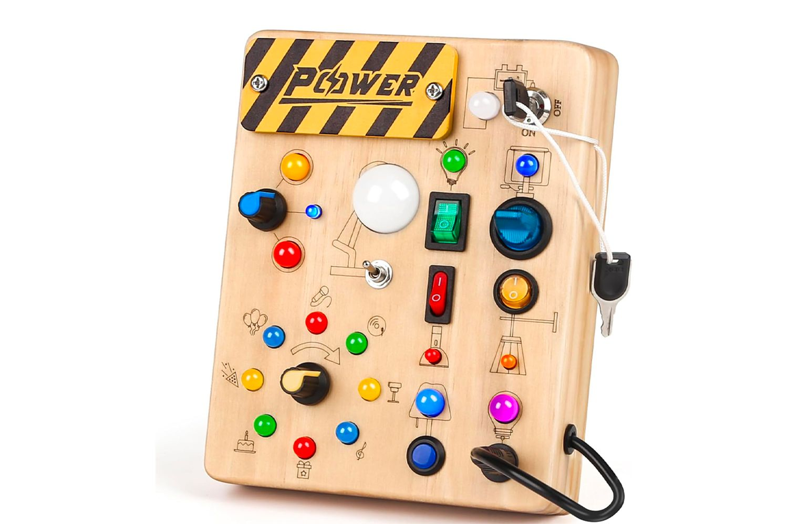
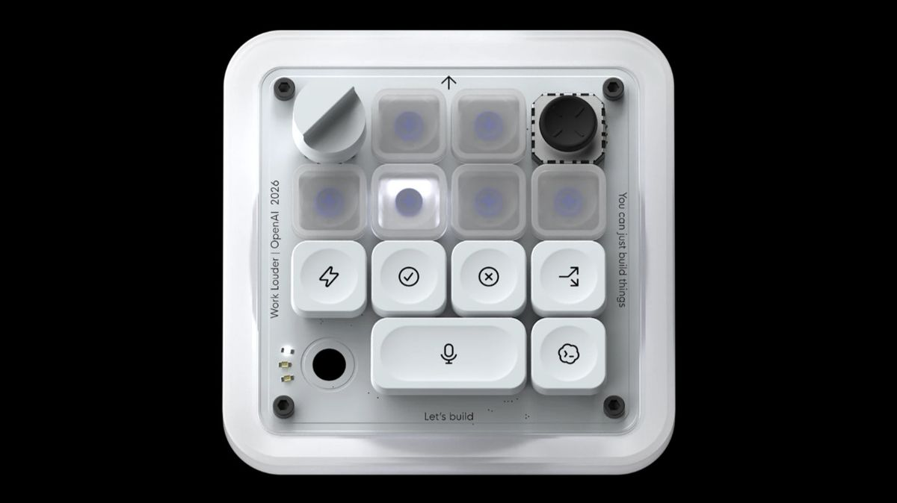

OpenAI recently released their first piece of physical hardware, the Codex Micro. This product release came [a little over a year after they announced they were working with Jony Ive on new AI-powered physical products](https://openai.com/sam-and-jony/):

> The ideas seemed important and useful. They were optimistic and hopeful. They were inspiring. They made everyone smile. They reminded us of a time when we celebrated human achievement, grateful for new tools that helped us learn, explore and create

The new Codex Micro was not created with Jony, but with [the Work Louder team](https://worklouder.cc/codex-micro). Still, given their lofty product goals I was interested to see what they were releasing. How were they going to revolutionize work and reshape the human experience?

OpenAI is billing the new Codex Micro as a command center for agentic coding:

<figure class="figure">
    
</figure>

Wait, I'm sorry, that is a picture of a busy board toy for toddlers. Here's the real image:

<figure class="figure">
    
</figure>

Unlike the busy board toy, Codex Micro is a serious tool for serious work. Here are a couple of quotes from [the demo video](https://www.youtube.com/watch?v=m8uUUUsMD3Y):

> I honestly can't imagine building without it anymore.

Wow!

> The analog stick is a great fidget toy while you're waiting for Codex to complete a task.

Huh... seems efficient I guess?

## What does it do?

> Codex Micro turns everything from reviewing a pull request, to generating a design system, to creating documentation, surprisingly tactile and engaging. Reducing repetitive prompting and keeping high-frequency workflows at just a twist, flick, or tap away.

In other words, the Codex Micro gives you some buttons, a knob, and an analog stick that allow you to interact directly with Codex (their coding agent) without needing to use your regular keyboard.

## What can you build with it?

You can build all the same things you already can. But now, you don't have to touch your keyboard as much!

The demo video shows a developer creating a word game with a simple voice prompt:

> Build a browser game called One Letter Off. Players change one letter at a time to turn the word cold to warm. Add a 30-second timer, streaks, and satisfying tile animations.

Clearly they're proud of the generated game. The video includes a quick, three-second clip:

<iframe width="560" height="315" src="https://www.youtube-nocookie.com/embed/m8uUUUsMD3Y?si=28fO5vybO3txmsdV&amp;start=111" title="YouTube video player" frameborder="0" allow="accelerometer; autoplay; clipboard-write; encrypted-media; gyroscope; picture-in-picture; web-share" referrerpolicy="strict-origin-when-cross-origin" allowfullscreen></iframe>

Their game copies the popular [Word Ladder](https://en.wikipedia.org/wiki/Word_ladder) game originally invented in 1877 by Lewis Carroll, the author of Alice in Wonderland. Unfortunately, you can't play their game anywhere. Luckily, there are already lots of versions of the game online. ([Weaver](https://wordwormdormdork.com/weaver/) is one example.)

The three second clip they shared shows almost no gameplay. You can see a player type a four letter word. That's it. Interestingly, the player breaks the rules of the game: they change two letters instead of one. It's odd they chose that clip to include.

Maybe they don't actually care about the game they built?

## Who cares? It's just a gimmick...

I actually really like word games. I made one of my own: [Tiled Words](https://tiledwords.com). My wife and I have made a new puzzle every day for the last 9 months. Forbes recently wrote about the game and [the article](https://www.forbes.com/sites/barrycollins/2026/05/02/bored-of-wordle-its-time-to-give-tiled-words-a-crack/) included an interesting quote:

> Tiled Words has something that most of the vibe-coded Wordle wannabes do not: love and care.

I was a little surprised to see Forbes throw shade at vibe-coded word games, but they're not wrong. I am active on [the Word Games subreddit](https://www.reddit.com/r/wordgames) and I love to see people's new games. But recently, more and more of the games seem half-baked: many are broken, uninspired, direct copycats, or have telltile signs of AI design tools. Some of them feel like they were created via a three-sentence prompt to Codex Micro.

In other words, they're "slop." [(Merriam Webster's 2025 word of the year.)](https://www.merriam-webster.com/wordplay/word-of-the-year) I'm glad people are able to make the games they want to make, and I'm not wholly opposed to the use of AI tools, but you can tell when someone put love and care into a project and when they didn't.

The online places I like to hang out are slowly getting drowned in low-quality AI slop. It's harder and harder to find the interesting human creations in the sea of noise.

## Slop comes to the real world

The Codex Micro has all the hallmarks of slop: it doesn't seem useful or interesting and seems to have been spewed into the world simply because it was possible. OpenAI doesn't even seem particularly proud of it: they didn't make any sort of official announcement post.

But unlike the slop I'm used to, the Micro is an expensive physical product. Slop is bad enough online. Let's leave it there.
