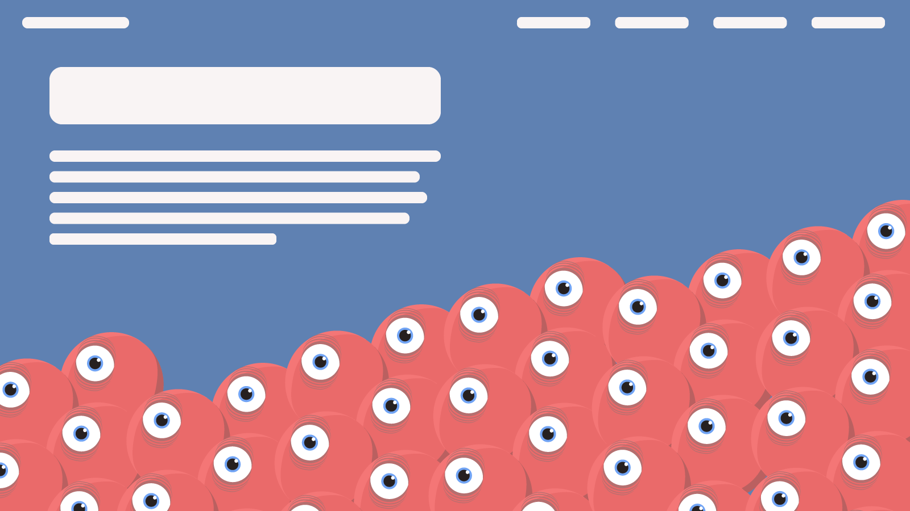

One thing I knew about the new site identity is that I wanted to inject a lot of
fun and quirky illustration, animation and interactivity into the site.

<figure class="figure">
  

  <figcaption class="figure__caption">
    An early illustration exploring the use of imagery in site designs.
  </figcaption>
</figure>

I explored a number of different options, starting with my sketchbook, then
moving into Illustrator, and finally into code.
