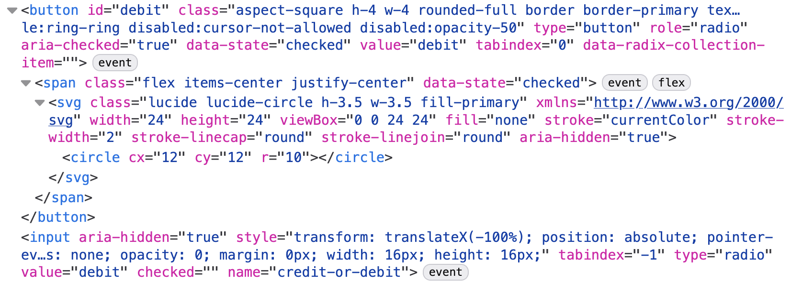

The other day I was asked to update the visual design of radio buttons in a web
app at work. I figured it couldn't be that complicated. It's just a radio button
right?

```html
<input type="radio" name="beverage" value="coffee" />
```

Boom! Done. Radio buttons are a built-in HTML element. They've been around for
30 years. The browser makes it easy. Time for a coffee.

## Enter Shadcn

I dug into our codebase and realized we were using two React components from
[Shadcn](https://ui.shadcn.com/) to power our radio buttons: `<RadioGroup>` and
`<RadioGrpoupItem>`.

For those unfamiliar with Shadcn, it's a UI framework that provides a bunch of
prebuilt UI components for use in your websites. Unlike traditional UI
frameworks like Bootstrap, you don't import it with a script tag or
`npm install`. Instead you run a command that copies the components into your
codebase.

Here's the code that was exported from Shadcn into our project:

```tsx
"use client";

import * as React from "react";
import * as RadioGroupPrimitive from "@radix-ui/react-radio-group";
import { CircleIcon } from "lucide-react";

import { cn } from "@/lib/utils";

function RadioGroup({
  className,
  ...props
}: React.ComponentProps<typeof RadioGroupPrimitive.Root>) {
  return (
    <RadioGroupPrimitive.Root
      data-slot="radio-group"
      className={cn("grid gap-3", className)}
      {...props}
    />
  );
}

function RadioGroupItem({
  className,
  ...props
}: React.ComponentProps<typeof RadioGroupPrimitive.Item>) {
  return (
    <RadioGroupPrimitive.Item
      data-slot="radio-group-item"
      className={cn(
        "border-input text-primary focus-visible:border-ring focus-visible:ring-ring/50 aria-invalid:ring-destructive/20 dark:aria-invalid:ring-destructive/40 aria-invalid:border-destructive dark:bg-input/30 aspect-square size-4 shrink-0 rounded-full border shadow-xs transition-[color,box-shadow] outline-none focus-visible:ring-[3px] disabled:cursor-not-allowed disabled:opacity-50",
        className,
      )}
      {...props}
    >
      <RadioGroupPrimitive.Indicator
        data-slot="radio-group-indicator"
        className="relative flex items-center justify-center"
      >
        <CircleIcon className="fill-primary absolute top-1/2 left-1/2 size-2 -translate-x-1/2 -translate-y-1/2" />
      </RadioGroupPrimitive.Indicator>
    </RadioGroupPrimitive.Item>
  );
}

export { RadioGroup, RadioGroupItem };
```

Woof... 3 imports and 45 lines of code. And it's importing a third party icon
library just to render a circle. (Who needs CSS `border-radius` or the SVG
`<circle>` element when you can add a third party dependency instead?)

All of the styling is done by the 30 different Tailwind classes in the markup. I
should probably just tweak those to fix the styling issues.

But now I'm distracted, annoyed, and curious. Where's the actual `<input>`?
What's the point of all this? Let's dig a little deeper.

## Enter Radix

The Shadcn components import components from another library called Radix. For
those unfamiliar with Radix, it's a UI framework that provides a bunch of
prebuilt UI components...

Wait a second! Isn't that what I just said about Shadcn? What gives? Why do we
need both? Let's see what the Radix docs say:

> Radix Primitives is a low-level UI component library with a focus on
> accessibility, customization and developer experience. You can use these
> components either as the base layer of your design system, or adopt them
> incrementally.

So Radix provides unstyled components, and then Shadcn adds styles on top of
that. How does Radix work? You can see for yourself on GitHub:
[https://github.com/radix-ui/...](https://github.com/radix-ui/primitives/blob/main/packages/react/radio-group/src/radio.tsx)

This is getting even more complicated: 215 lines of React code importing 7 other
files. But what does it actually do?

## Taking a look in the browser

Let's look in the browser dev tools to see if we can tell what's going on.



Okay, instead of a radio input it's rendering a button with an SVG circle inside
it? Weird.

It's also using
[ARIA attributes](https://developer.mozilla.org/en-US/docs/Web/Accessibility/ARIA)
to tell screen readers and other assistive tools that the button is actually a
radio button.

ARIA attributes allow you to change the semantic meaning of HTML elements. For
example, you can say that a button is actually a radio button. (If you wanted to
do that for some strange reason.)

Interestingly, here's the
[First Rule of ARIA use](https://www.w3.org/TR/using-aria/#rule1):

> If you _can_ use a native HTML element or attribute with the semantics and
> behavior you require **already built in**, instead of re-purposing an element
> and adding an ARIA role, state or property to make it accessible, **then do
> so**.

Despite that, Radix is repurposing an element and adding an ARIA role instead of
using a native HTML element.

Finally, the component also includes a hidden `<input type="radio">` but only if
it's used inside of a `<form>` element. Weird!

This is getting pretty complicated to just render a radio button. Why would you
want to do this?

## Styling radio buttons is hard (Wait, is it?)

My best guess is that Radix rebuilds the radio button from scratch in order to
make it easier to style. Radio buttons used to be difficult to style
consistently across browsers. But for several years we've been able to style
radio buttons however we want using a few CSS tools:

- `appearance: none` removes the radio button's default styling allowing us to
  do whatever we want.
- We can use the `::before` pseudo-element to render a "dot" inside of the
  unstyled radio button.
- We can use the `:checked` pseudo-class to show and hide that dot depending on
  whether the radio button is checked.
- `border-radius: 50%` makes things round.

Here's an example implementation:

```css
input[type="radio"] {
  /* Disable the browser's default radio button styles */
  appearance: none;
  margin: 0;

  /* Recreate the circle container */
  border: 1px solid black;
  background: white;
  border-radius: 50%;

  /* Center our dot in the container */
  display: inline-grid;
  place-content: center;

  /* Use a pseudo-element to display our "dot" */
  &::before {
    content: "";
    width: 0.75rem;
    height: 0.75rem;
    border-radius: 50%;
  }

  /* And display it when the radio button is checked */
  &:checked::before {
    background: black;
  }
}
```

This doesn't require any dependencies, JavaScript, or ARIA roles. It's just an
input element with some styles. (You can do the same thing with Tailwind if
that's your jam.)

It does require knowledge of CSS but this isn't some arcane secret.
[Googling "how to style a radio button"](https://www.google.com/search?q=how+to+style+a+radio+button)
shows several blog posts explaining these techniques. You may say this is a lot
of CSS, but the Shadcn component we were using had 30 Tailwind classes!

## I'm not trying to convince you to write your own component styles

Look, I get it. You've got a lot going on. You're not big on CSS. You just want
to grab some prebuilt components so you can focus on the actual problem you're
solving.

I totally understand why people reach for component libraries like Shadcn and I
don't blame them at all. But I wish these component libraries would keep things
simple and reuse the built-in browser elements where possible.

## Who cares?

Web development is hard. There's inherent complexity in building quality sites
that solve problems and work well across a wide range of devices and browsers.

But some things don't have to be hard. Browsers make things like radio buttons
easy. Let's not overcomplicate it.

To understand how our radio buttons work I need to understand two separate
component libraries and hundreds of lines of React.

Website visitors need to wait for JavaScript to load, parse, and run in order to
be able to toggle a radio button. (In my testing, just adding these components
added several KB of JS to a basic app.)

## It's just a radio button

Why am I making such a big deal out of this? It's just a radio button.

But these small decisions add up to more complexity, more cognitive load, more
bugs, and worse website performance.

## We have strayed so far from the light

Look at it. It's beautiful:

```html
<input type="radio" name="beverage" value="coffee" />
```
