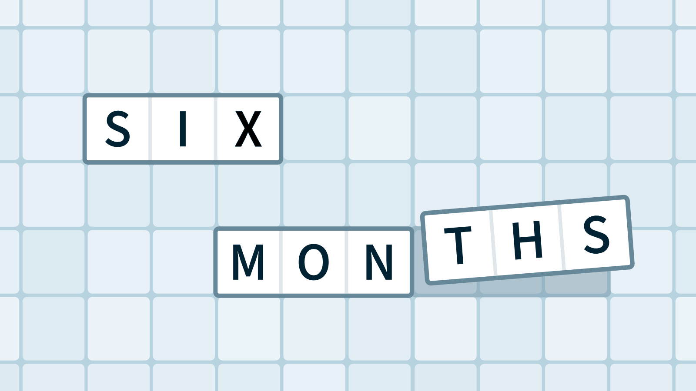
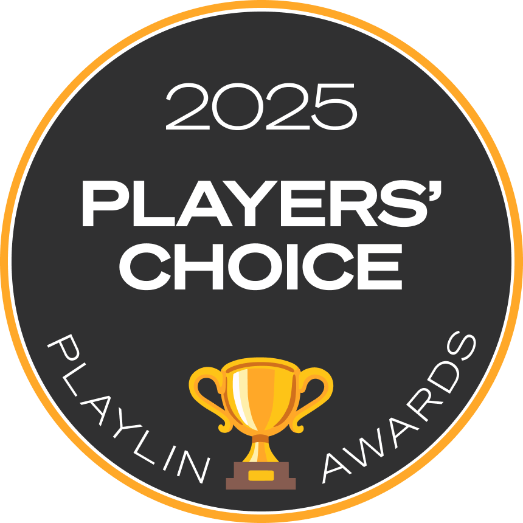
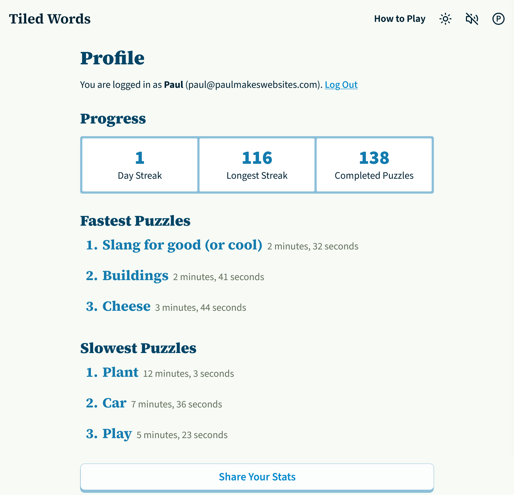
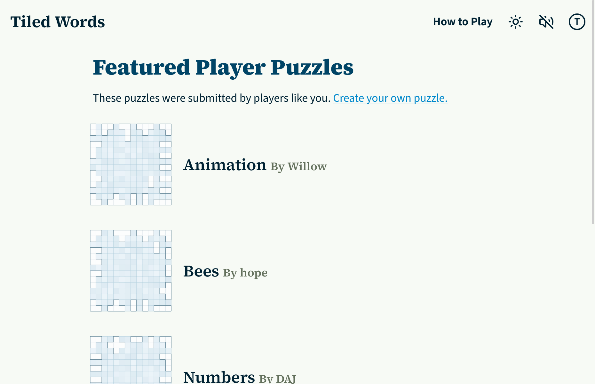
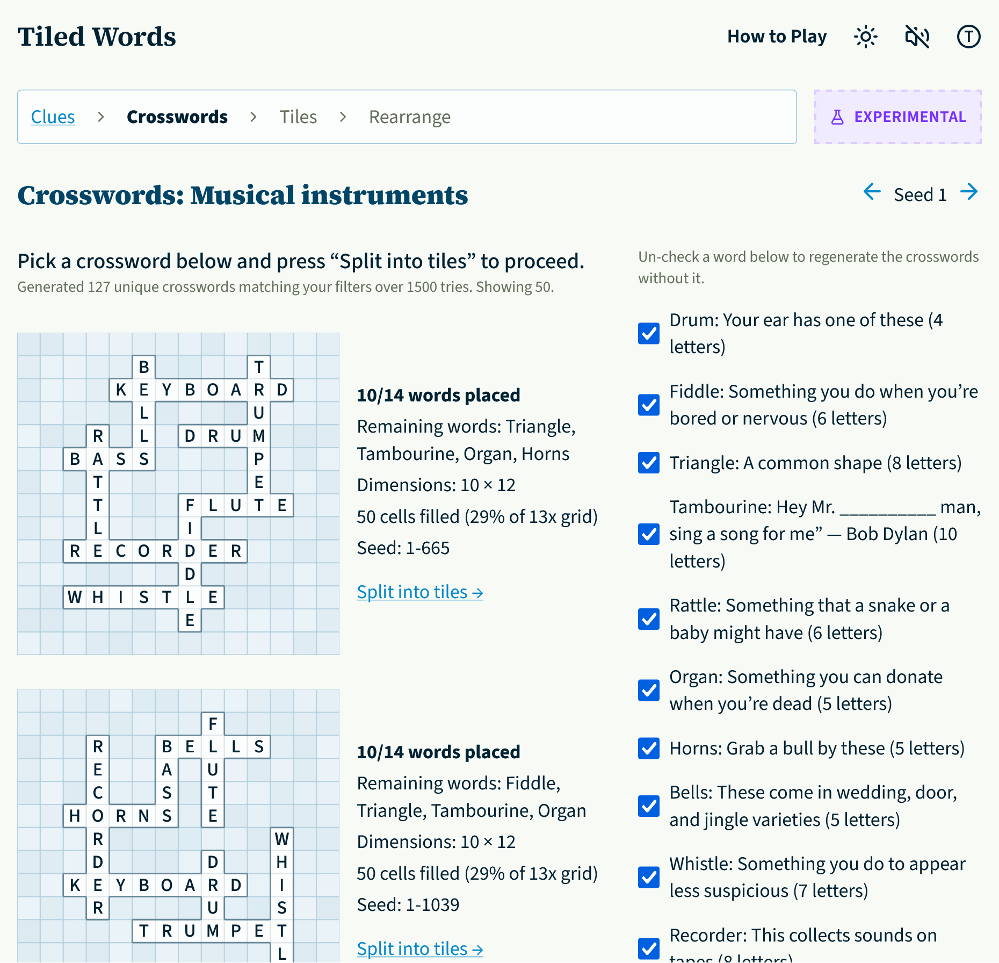

_This flies when you're having fun (4 letters)_

I've wanted to make games ever since I was a kid. I remember my dad taught me the programming language "Basic" and together we made a simple number guessing game. You would guess a number and it would say "Oh my, too high!" or "Oh no, too low!"

As an adult I've tried making a few different games but I've never had much success. It's hard to find the right combination of ideas to make a fun game. It's even harder to actually finish the game!

## Launching Tiled Words

So when I launched [Tiled Words](https://tiledwords.com) I didn't expect much. I thought it would be a fun little project. If I was lucky a few hundred people might play it. I would make puzzles for a month or two and then wind it down as people lost interest and I lost enthusiasm.

To my surprise and delight, the project has surpassed all of my expectations: Thousands of people play every day. It even [won an award](https://playlin.io/news/announcing-the-2025-playlin-awards-winners/)!

## A puzzle a day is a lot of puzzles...

Somehow it's been 6 months since that launch! During that time my wife and I have released a new puzzle every day. (We're going to break 200 puzzles next week.) This is a lot of work but also a lot of fun.

We brainstorm themes while walking the dog and trade clue ideas over lunch. After the baby goes to sleep I turn the clues into a crossword and finish the puzzle. (You can [read a little about my puzzle-building tools here](https://paulmakeswebsites.com/writing/building-tools-for-myself/) though I've made a lot of upgrades since writing that.)

Here are a few of our favorites:

- [Invertebrates](https://tiledwords.com/puzzles/2026-03-14)
- [Seed](https://tiledwords.com/puzzles/2026-03-26)
- [Cooking Instructions](https://tiledwords.com/puzzles/2026-01-01)
- [Space](https://tiledwords.com/puzzles/2026-03-21)

## Thanks for all the feedback

People have submitted feedback through the website almost 700 times as well as reaching out over email or social media. They report bugs, suggest improvements, and point out issues with clues. This directly improves the puzzles and game.

The feedback that means the most to me is about people sharing Tiled Words with their loves ones. One puzzler plays it with their mom who is recovering from a stroke. Another plays it with their special needs kids. Another played it with a family member while they were in the hospital. A dad plays it while bouncing their baby to sleep. And lots of people play it with family, sometimes overseas, and sometimes sitting around a backyard fire pit.

Not everyone is nice. A few people have submitted rude or hurtful feedback but it's a drop in the ocean compared to the positive feedback we get about the game.

## Recent updates

A lot of people requested the ability to create user accounts so they can sync their progress and play across multiple devices. These just launched about a week ago:

<figure class="figure">

<figcaption class="figure__caption">It's been really fun seeing people share their stats after creating a profile.</figcaption>
</figure>

## Upcoming features

Right now I'm working on two related features that should be launching soon:

### Player-submitted puzzles

Players have submitted a few dozen of their own clue sets and I'm excited to turn them into finished puzzles that people can play. Here's a sneak peek:

<figure class="figure">

<figcaption class="figure__caption">Thank you to everyone who submitted puzzles for your patience as I build this out. I know some of you have been waiting months now.</figcaption>
</figure>

### Sharing my puzzle-building tools

I have custom tools that I use to create the Tiled Words puzzles. I'd like to let other people use these to submit finished puzzles. But the tools are rough around the edges. I'm cleaning these up and getting ready to share them:

<figure class="figure">

<figcaption class="figure__caption">Reach out if you want to help beta test!</figcaption>
</figure>

### What features would you like to see?

Are there features you would like to see added to Tiled Words? A leaderboard? A notification system? Something else?
Use [the Tiled Words feedback form](https://tiledwords.com/feedback) and let me know.

## Thank you for playing

All of your feedback and enthusiasm keeps us motivated and makes the project worth it. It always makes me smile to see people share their scores and discuss different puzzles and clues.

Some people even share videos of their puzzle solve which is really fun to watch:

<figure class="figure">
<iframe style="width: 100%; aspect-ratio: 16/9;" src="https://www.youtube.com/embed/zA4PshGRoVk?si=s5IVHh3lkQinlUlG&amp;start=144" title="YouTube video player" frameborder="0" allow="accelerometer; autoplay; clipboard-write; encrypted-media; gyroscope; picture-in-picture; web-share" referrerpolicy="strict-origin-when-cross-origin" allowfullscreen="" data-v-fdbb9525="" loading="lazy"></iframe>

<figcaption class="figure__caption">It was a fun surprise to watch Simon from Cracking the Cryptic playing Tiled Words.  You can also watch <a href="https://www.youtube.com/playlist?list=PLZaQ4HDFuibch-oaR6FlG1oBR8FWbYCla">Timotab</a>, <a href="https://www.youtube.com/watch?v=bb8asScb9Ko&list=PL_HjFt2zdfHUOWZkbkqAkoei0K_okRa69&index=20">Scott Stro</a> and <a href="https://www.youtube.com/watch?v=CrWm_A6w20M&list=PLhBmoVSDCrRdEDOvSwARsDM1vkVyXD-wm&index=2">Ambie</a> play.</figcaption>
</figure>

## Anyways, I have more puzzles to build...

Have you played [today's puzzle](https://tiledwords.com/puzzles/daily) yet?
